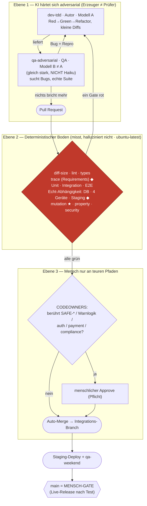

# KI-Verifikations-Pipeline (vereint) — Prinzip, Gates, Fluss

Merge aus **zwei Quellen**, die dasselbe wollten:
- **JTC-Pilot** (dieses Repo): der laufende, bewiesene Aufbau — dev↔qa-Loop,
  deterministisches Gate, Requirements-Traceability, Echt-Abhängigkeits-
  Integration (DB/Staging/4-Geräte), autonomer lokaler Treiber.
- **KI-VERIFIKATION-UEBERGABE** (Self_Organisation): schärft die Theorie und
  ergänzt drei fehlende Bausteine — **Modell-Diversität**, **Mutation-Gate**,
  **Property-Tests** — plus CODEOWNERS als menschliches Gate und Tool-Mapping
  pro Sprachwelt.

Diese Datei ist die zusammengeführte Wahrheit. Prinzip unten: **Erzeuger ≠
Prüfer** — getrennt in Rolle UND Modell; ein deterministischer Boden rahmt jede
KI-Entscheidung ein, der nicht halluzinieren kann.

## Was der Merge übernimmt / erhält / ergänzt

| Baustein | JTC-Pilot | Übergabe | **Vereint** |
|---|---|---|---|
| dev-tdd ↔ qa-adversarial ↔ dev-loop | ✅ läuft | ✅ beschrieben | ✅ Basis |
| „Maschine urteilt, nicht der Agent" | ✅ (Gate deckte Fake-Grün auf) | ✅ (deterministischer Boden) | ✅ Kern |
| **Modell-Diversität** (QA ≠ Autor-Modell, nicht Haiku) | ❌ **Lücke** | ✅ Pflicht | ✅ **NEU übernommen** |
| **Mutation-Gate** (Tests fangen echte Bugs?) | ❌ **Lücke** | ✅ Kern ★ | ✅ **NEU übernommen** |
| **Property-Tests** (Invarianten × Zufall) | ❌ | ✅ | ✅ **NEU übernommen** |
| **CODEOWNERS** an teuren Pfaden | ⚠️ manuell | ✅ GitHub-Regel | ✅ **NEU als Regel** |
| diff-size · security (gitleaks/semgrep) | ✅ auf main | ✅ | ✅ |
| **Requirements-Traceability (`trace`)** | ✅ **stark** | ❌ fehlt | ✅ **erhalten** |
| **Echt-Abhängigkeit** (DB/Staging/4-Geräte/qa-weekend) | ✅ **stark** | ⚠️ nur „tests" | ✅ **erhalten** |
| Runner auf `ubuntu-latest`, nicht Prod/VPS | ✅ (Lehre) | ✅ (Regel) | ✅ |
| Auto-Merge-Ziel | Integrations-Branch → Staging, **main = Mensch** | auto-merge → main | ✅ **konservativ: main bleibt Mensch-Gate** (Sicherheitsbezug der Segel-App) |
| Autonomer lokaler Treiber (Agent baut, Gate urteilt) | ✅ | — | ✅ erhalten |

## Der vereinte Fluss

Legende: **★ Mutation** = der KI-unabhängige Beweis, dass das Testnetz Löcher
hat; **◆** = Bausteine, die der JTC-Pilot einbringt (Traceability + echte
Abhängigkeiten), die in der reinen Theorie-Übergabe fehlen.

## Warum Mutation-Gate der Kern ist (Beleg aus diesem Repo)

Weil die KI die Tests SELBST schreibt, ist die Hauptgefahr, dass Tests nur den
Code spiegeln (grün, fangen aber nichts) — oder gar nie echt liefen. Genau das
ist hier passiert: der dev↔qa-Loop meldete „438 Tests grün", das deterministische
Gate zeigte 5 API-E2E-Specs mit falscher URL UND falschem Vertrag — sie waren nie
grün. Ein **Mutation Score** hätte solche Scheingrünheit sofort als Löcher im Netz
ausgewiesen. Coverage tut das NICHT (schwacher Prädiktor). Darum: Mutation, nicht
Coverage.

## Tool-Mapping pro Sprachwelt

| Gate | JS/TS (JTC) | Python (Certi4Safety) |
|---|---|---|
| diff-size | git-Script (`agentic-gate`) | git-Script (identisch) |
| lint | ESLint (nur Errors blocken) | ruff |
| types | `tsc --strict` | mypy (strict am Kern) |
| tests | node:test/Vitest · Playwright | pytest · Playwright |
| **mutation ★** | Stryker | mutmut / cosmic-ray |
| **property** | fast-check | hypothesis |
| security | semgrep OSS + gitleaks | semgrep OSS + gitleaks |
| trace ◆ | `npm run trace` (REQ-IDs) | eigenes trace-Script analog |

## Reihenfolge der Einführung (nicht beliebig)

0. **Laufende CI, Runner GETRENNT von Prod.** (JTC-Lehre: CI-Last auf dem
   Prod-VPS warf die Live-App um → alles auf `ubuntu-latest`.)
1. Boden gießen: diff-size + security zuerst (billig), Scanner als
   `continue-on-error`, erst nach FP-Messung scharf (>10 % FP → wird ignoriert).
2. Mutation + Property auf die **Kern-Logik** (nicht ganzes Repo — unbezahlbar),
   erst als wöchentlicher Cron-Report, dann Gate auf Ist-Score.
3. Adversariale Schicht: dev-loop als Pflicht vor jedem PR, **Modell-Diversität
   erzwingen** (im Workflow konfiguriert: Autor ≠ QA-Modell).
4. Scharfstellen: Required Checks setzen (nicht leer lassen — heimlicher
   Killer!), Auto-Merge nur bei allem grün, CODEOWNERS-Gate aktiv, main = Mensch.

## Fallen (bewusst nicht tun)

- QA-Agent = Autor-Modell → hebt die Generator-Verifier-Trennung auf.
- Mutation aufs ganze Repo → zu langsam. Nur Kern-Logik.
- Scanner sofort blockend → wird am ersten roten Tag abgeschaltet.
- Required Checks scharf ohne Runner-Redundanz → toter Runner blockiert `main`.
- CodeQL bei privaten Repos → kostenpflichtig; semgrep OSS reicht.
- Coverage-Maximierung als Selbstzweck → schwacher Defekt-Prädiktor.

## Umsetzungsstand in diesem Repo

- ✅ Ebene 1 (dev-loop), Boden-Teil (diff-size, security, verify, trace, echte
  DB/4-Geräte/Staging), autonomer Treiber, GATES.md.
- ⬜ **Modell-Diversität** im Loop (Änderung in `.claude/workflows/dev-qa-loop.js`).
- ✅ **Mutation-Gate** (Stryker) auf den Kern-Libs. **Baseline 2026-07-16: 75,7 %**
  (peilung 80 % · route-profiles **63 %**, 83 überlebende Mutanten = Testlücken).
  Wöchentlicher Report `.github/workflows/mutation.yml`, `break` noch `null`
  (report-only); nach stabilem Trend auf den Ist-Boden heben. Erster konkreter
  Auftrag daraus: route-profiles-Tests nachlegen (34 überlebende Mutanten).
- ⬜ **Property-Tests** (fast-check) für die reinen Libs (peilung, routing, poi).
- ⬜ **CODEOWNERS** für SAFE-*/Warnlogik.

---

## Einordnung: ein Baustein im System-of-Systems

Dies ist die **Entwicklungs- & Verifikations-Komponente**. Sie liefert, was jede
andere Komponente braucht: dass gebauter Code nachweislich stimmt, ohne dass ein
Mensch jede Zeile liest. Andere Bausteine (Erlebnis-Wissen, Research-Scout,
Deadline-/Karpathy-Routinen …) sind fachlich; dieser hier ist der Qualitäts-Boden
darunter — überall gleich, per Sprachwelt nur anders verdrahtet.

## Bausteine & Links (der eine Ort)

| Baustein | Was | Ort |
|---|---|---|
| **dev-tdd** (Skill) | Autor-Rolle, testgetrieben | `.claude/skills/dev-tdd/` · global `~/.claude/skills/dev-tdd/` |
| **qa-adversarial** (Skill) | Prüfer-Rolle, bricht adversarial | `.claude/skills/qa-adversarial/` · global |
| **dev-loop** (Skill) | Einstieg `/dev-loop`, wann welcher Pfad | `.claude/skills/dev-loop/` · global |
| **dev-qa-loop** (Workflow) | orchestriert dev↔qa, Modell-Diversität | `.claude/workflows/dev-qa-loop.js` · global |
| **aspice-istqb-workflow** (Skill) | Requirements-IDs, Traceability | `.claude/skills/aspice-istqb-workflow/` |
| **ki-verifikation** (diese Datei) | Architektur, Gates, Fluss, Tool-Mapping | `docs/ki-verifikation.md` |
| **GATES** | welche CI-Gates hier laufen und warum | `docs/GATES.md` |
| **feature-pipeline** | gestapelte 80%-Pipeline, Integrations-Kopf | `docs/feature-pipeline.md` |
| **autonomer Treiber** | Agent baut, Gate urteilt (lokal, inert) | `scripts/pipeline/` |
| **Prozess-Metriken** | wöchentliche Messung + Log | `scripts/process-metrics.sh` · `docs/process-metrics.md` |
| **Bug-Historie** | BUG-IDs + Regressionstests (SUP.9) | `docs/BUGLOG.md` |

## Messung & Justierung über die Zeit

`scripts/process-metrics.sh` misst schlank aus dem Repo-Zustand (REQs, mit Tests,
REQ-Tags, Testdateien, Bugs, **Mutation-Score**) und hängt eine datierte Zeile an
`docs/process-metrics.md`. **Wöchentlich per Cron** ausführen → Trend statt
Momentaufnahme. Regel: Schwellwerte (diff-size-Grenze, Mutation-Mindestscore,
Scanner scharf/beobachtend) an diesen Ist-Zahlen justieren, nicht raten. Sinkt
der Mutation-Score → Testnetz bekommt Löcher → nachlegen, bevor ein Gate rot wird.

## Für andere Projekte übernehmen

1. **Global schon da** (dieser Mac): `~/.claude/skills/{dev-tdd,qa-adversarial,
   dev-loop}` + `~/.claude/workflows/dev-qa-loop.js` — projektneutral, erkennen
   die Test-/Build-Befehle selbst. In jedem Repo greift `/dev-loop`.
2. **Anderer Rechner/Repo:** den portablen Prozess-Prompt geben (siehe unten)
   oder diese Datei kopieren und einer Session sagen „setz das gemäß
   docs/ki-verifikation.md um".
3. **Sprachwelt:** Tool-Mapping-Tabelle oben (Stryker/mutmut, fast-check/
   hypothesis, ESLint/ruff). Einführungsreihenfolge + Fallen ebenfalls oben.
4. **Repo-Overlay gewinnt** gegen die globale Version — jedes Projekt tunt seine
   Befehle, ohne die generische Vorlage zu berühren.

Portabler Prompt (in ein fremdes Repo geben): siehe die Kurzfassung in
`.claude/skills/dev-loop/SKILL.md` bzw. den Handover-Text im Self_Organisation-
Repo (`KI-VERIFIKATION-UEBERGABE.md`).
